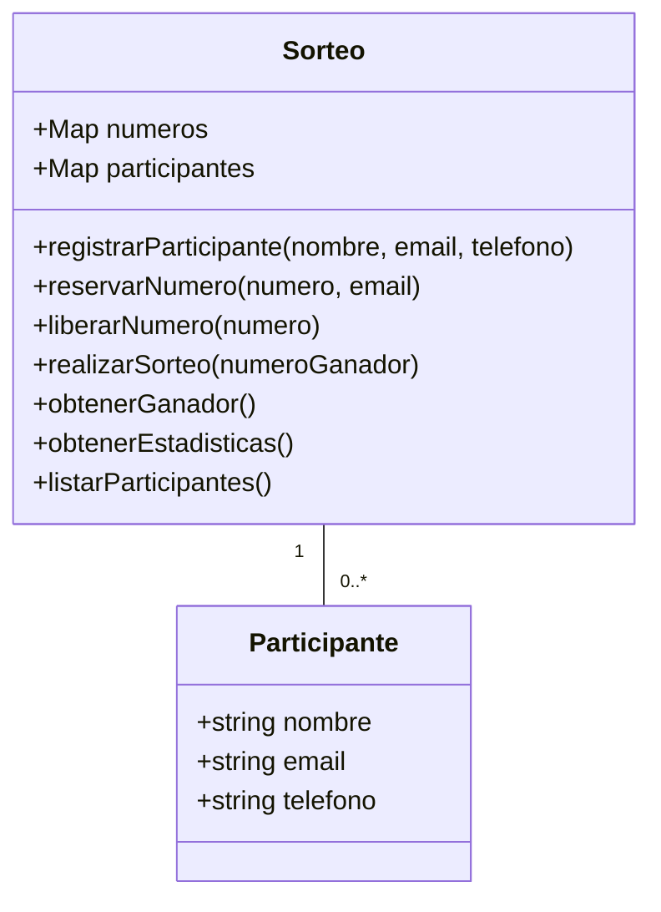

# Sorteo de la Cesta de Navidad

Esta es una aplicación web simple para gestionar el tradicional sorteo de la cesta de navidad.

## Descripción

La aplicación permite a los usuarios registrarse como participantes, reservar números en un tablero de 100 números (del 00 al 99), y determinar un ganador basado en un número introducido manualmente (simulando el sorteo de la Lotería Nacional).

## Requisitos

- Node.js y npm instalados.

## Instalación y Ejecución

1. Clona este repositorio.
2. Abre una terminal en el directorio del proyecto.
3. Instala las dependencias con `npm install`.
4. Compila el código TypeScript con `npx tsc`.
5. Abre el archivo `index.html` en tu navegador.

## Documentación Técnica

### Diagrama de Clases

### Interfaces y Tipos

- **`Participante`**: Representa a un participante con su nombre, email y teléfono.
- **`NumeroSorteo`**: Representa un número del tablero y el participante que lo ha reservado (o `null` si está libre).
- **`Tablero`**: Representa el estado del sorteo, incluyendo el mapa de números y el mapa de participantes.

### Decisiones de Diseño

- **Separación de Lógica**: La lógica de negocio (clases `SorteoClass` y `ParticipanteClass`) está separada de la lógica de la interfaz de usuario (UI) para mejorar la mantenibilidad y facilitar las pruebas.
- **Clases y Tipos**: Se utilizan clases para modelar las entidades principales (`Sorteo` y `Participante`) y se definen interfaces para asegurar la estructura de los datos.
- **Manejo de Errores**: Se lanzan excepciones personalizadas para operaciones no válidas (por ejemplo, reservar un número ya ocupado), que son capturadas y mostradas en la interfaz de usuario.
- **Pruebas Unitarias**: Se utiliza Jest y `ts-jest` para realizar pruebas unitarias de toda la lógica de negocio, asegurando su correcto funcionamiento.

## Ejemplos de Uso

1.  **Registrar un participante**: Rellena el formulario de registro y haz clic en "Registrar".
2.  **Reservar un número**: Introduce un número y el email del participante y haz clic en "Reservar Número".
3.  **Liberar un número**: Introduce un número y haz clic en "Liberar Número".
4.  **Realizar el sorteo**: Introduce el número ganador y haz clic en "Realizar Sorteo".
